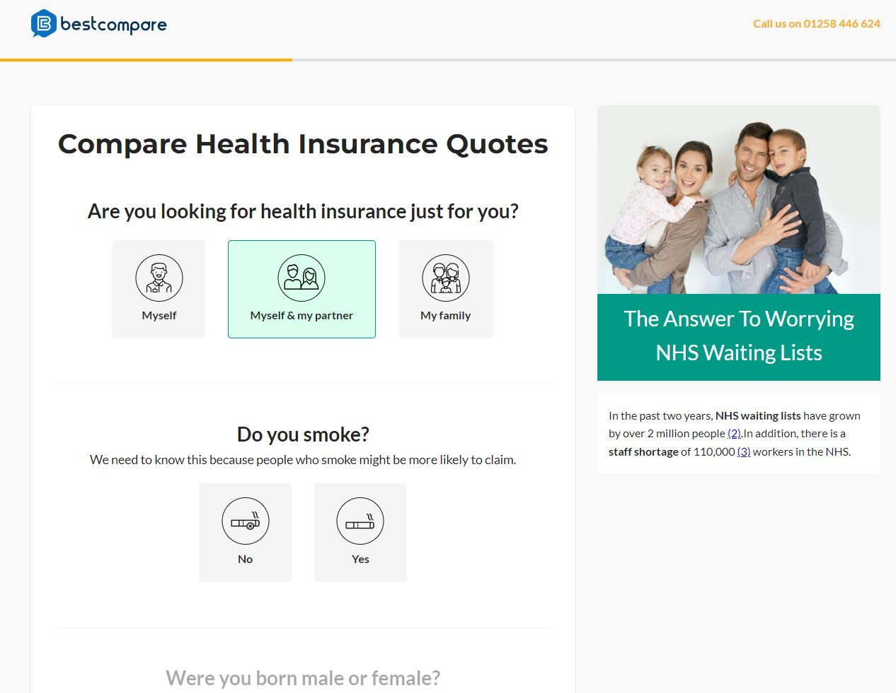
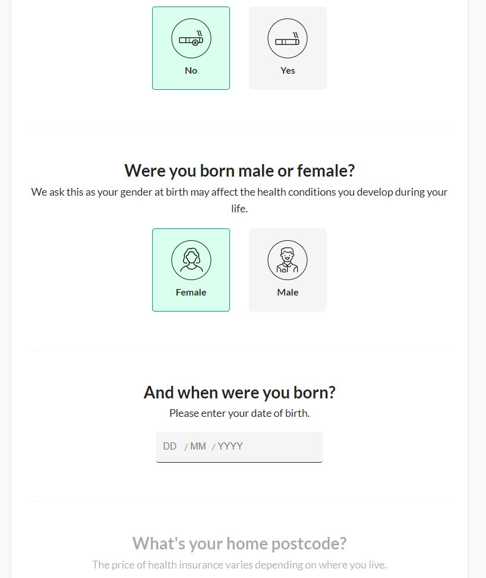

# Step Form Project

## Overview

This project implements a multi-step form with a dynamic user interface, providing an intuitive and seamless experience for collecting user data. The form includes multiple sections, each dedicated to gathering specific information, and guides the user through a progressive journey from start to submission.

### Key Features

- **Dynamic Step Progression:** The form is divided into multiple sections. Users proceed to the next step only after completing the current one, ensuring a structured and focused user journey.
- **Real-time Validation:** Each input field undergoes real-time validation. The form provides instant feedback on the correctness of the data entered, enhancing user experience and data accuracy.
- **LocalStorage Integration:** User's data, specifically their full name, is stored locally, allowing for a personalized experience, especially on the thank you page.
- **Responsive Design:** The form is fully responsive, providing a seamless experience across various devices and screen sizes.
- **Interactive Elements:** Enhanced user interface with interactive elements like disabled/enabled submit buttons based on form completion, and smooth scrolling to the first invalid input upon submission attempt.

### Technical Details

- **Font and Style:** The form uses modern and readable fonts, ensuring excellent readability and a clean look.
- **JavaScript Logic:** Extensive use of JavaScript for handling form validation, LocalStorage interactions, and dynamic content updates.
- **Form Validation:** Each input field is validated for specific criteria, and the form submission is contingent on the successful validation of all fields.

### Form Behavior

1. **Initial State:** All sections after the first are disabled. The submit button is disabled.
2. **Section Completion:** Upon completing a section, the next section becomes active.
3. **Validation:** Each input is validated in real-time. Incomplete or invalid inputs prevent progression.
4. **Local Storage:** The user's full name is stored in LocalStorage and used on the thank you page.
5. **Final Submission:** On submission, data is logged to the console, and the user is redirected to a thank you page, where their name is displayed.

### Screenshots

_Screenshot of the initial form state._

_Screenshot showcasing form validation._

## Conclusion

This step form project exemplifies a blend of good design principles, user experience considerations, and front-end development practices. It serves as a template for building interactive and user-friendly forms for web applications.
